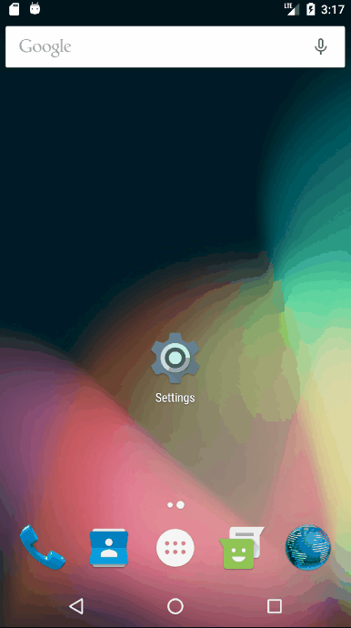
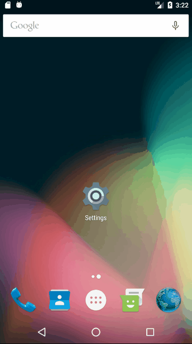
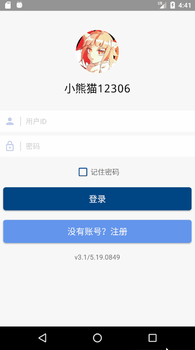
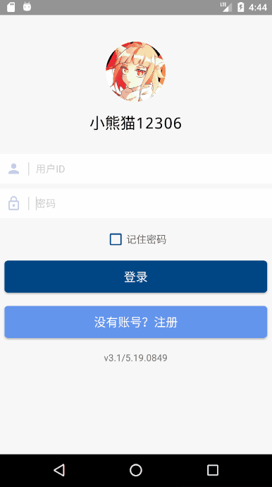
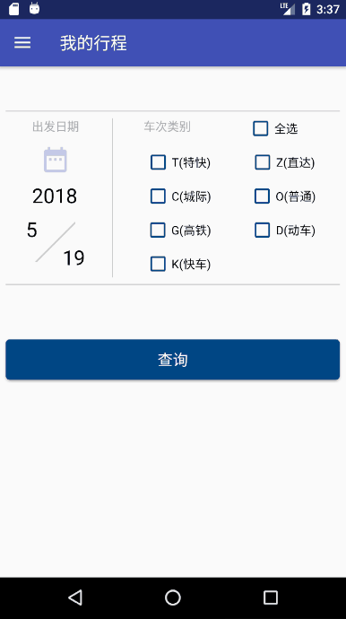
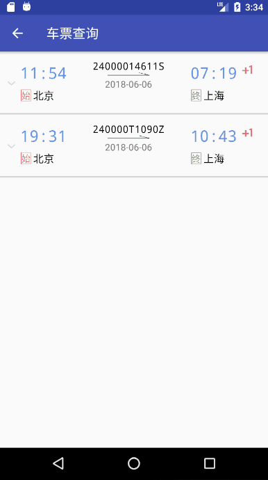
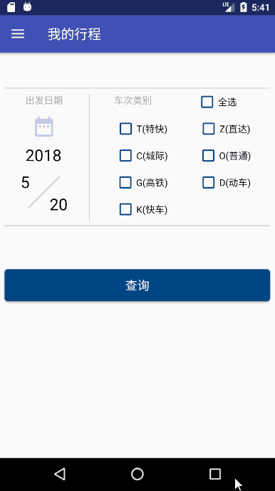
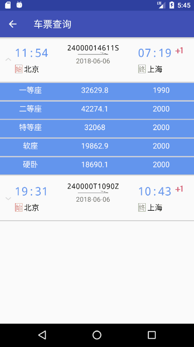
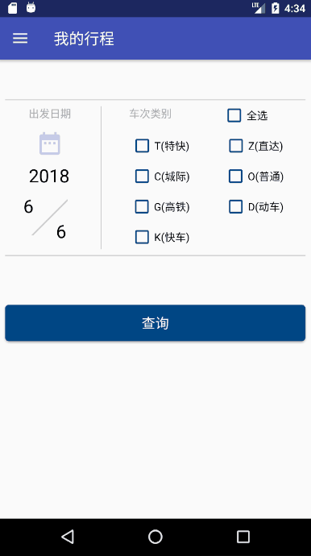
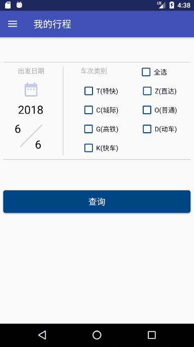

# 火车订票系统TTRS for Android使用手册

### 《系统安装手册》

从http://120.79.236.3:5000/ 获取最新APK文件，打开并按提示完成安装过程

### 《用户手册》

#### 基础操作

1、启动、注册、登录

2、记住密码

3、注册、登录错误提醒

#### 用户相关

1、用户信息修改

2、用户信息、权限修改

4、用户信息查询错误提醒

#### 车票相关

1、购票、退票

2、查票

3、购票、退票错误提醒

4、查票错误提醒

#### 车次相关

1、查询车次

2、新增、修改车次

3、公开、删除车次

4、查看时刻表

5、查询车次错误提醒

6、新增车次错误提醒

7、公开、删除车次错误提醒

## 收获

>“不妨假设心灵是一张白纸，没有任何符号，没有任何想法。
>你们心灵是如何丰富起来的？
>人类无限的想象力在其中描绘出了无穷无尽的可能性，这是从哪里来的？
>知识和推理，又是从哪里来的？
>我的答案只有一句话，从经历中来。”
>——约翰·洛克《人类理解论》

积累了一些Android开发经验以及UI设计经验
对Android软件架构有了深刻理解
理解了一些软件开发哲学
当然，最重要的，是经历

