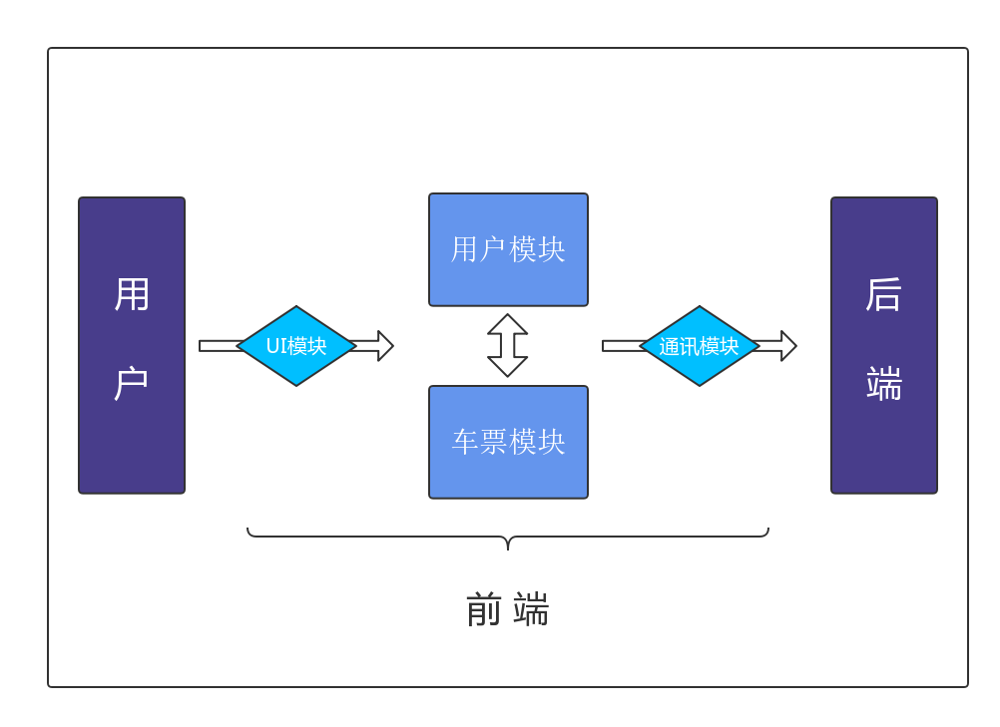

#火车票订票系统TTRS开发文档

---

#简介

软件名称：小熊猫12306

适用平台：Android 6.0(Marshmallow) - Android 8.1(Oreo)  (API 23 - API 27)

开发工具：Android Studio 3.1.2

开发环境：windows10、macOS High Sierra 10.13.4、ubuntu16.04

测试平台：Android Virtual Devices、Huawei MLA-AL 10、VIVO Xplay6、 Sony Xperia xzs

测试环境：Android 6.0、 Android 7.11、Android 8.0

开发技术：Java + xml


##模块划分图



##模块设计

###通讯模块

> 一切安全问题开始于隔阂（Gap）。比如说，如果从现在开始来设计编译器和CPU，还会有缓冲区溢出吗？这里体现的就是历史的隔阂。人无法超越他所处的时代，时代的变化产生人所无法预料的新隔阂。
>
> ——《网络安全的哲学思考》 作者：devway (from xfocus bbs)

本app与服务器的通讯基于http协议，采用了`OkHttp3.10.0`通讯框架，利用轻量级数据交换格式JSON对传输数据进行封装，使用$AES-256$对称加密算法和$Base64$编码两重包装进行数据的安全传递。

封装`AESUtil`类用于字符串的AES和Base64加解密

```java
public class AESUtil {

    public static String Encrypt(String sSrc, String sKey) throws Exception {
        byte[] raw = sKey.getBytes("utf-8");
        SecretKeySpec skeySpec = new SecretKeySpec(raw, "AES");
        Cipher cipher = Cipher.getInstance("AES/ECB/PKCS5Padding");
        cipher.init(Cipher.ENCRYPT_MODE, skeySpec);
        byte[] encrypted = cipher.doFinal(sSrc.getBytes("utf-8"));
        return Base64.encodeToString(encrypted, Base64.NO_WRAP);
    }

    public static String Decrypt(String sSrc, String sKey) throws Exception {
        try {
            byte[] raw = sKey.getBytes("utf-8");
            SecretKeySpec skeySpec = new SecretKeySpec(raw, "AES");
            Cipher cipher = Cipher.getInstance("AES/ECB/PKCS5Padding");
            cipher.init(Cipher.DECRYPT_MODE, skeySpec);
            byte[] encrypted1 = Base64.decode(sSrc, Base64.NO_WRAP);
            try {
                byte[] original = cipher.doFinal(encrypted1);
                String originalString = new String(original,"utf-8");
                return originalString;
            } catch (Exception e) {
                System.out.println(e.toString());
                return null;
            }
        } catch (Exception ex) {
            System.out.println(ex.toString());
            return null;
        }
    }
}
```


封装`HttpClient` 类用于向服务器发起Http请求并收到回复

```java
public class HttpClient {
    private String command;
    private String responseData;
    private Context context;
    //KEY

    public HttpClient(){
        this.context = context;
    }
    public void setCommand(String command) {
        this.command = command;
    }

    public String run() {
        try {
            String commandEncoded = AESUtil.Encrypt(command, KEY);
            OkHttpClient client = new OkHttpClient.Builder().connectTimeout(100, TimeUnit.SECONDS).readTimeout(200, TimeUnit.SECONDS).build();
            RequestBody requestBody = new FormBody.Builder().add("input", commandEncoded).build();
            Request request = new Request.Builder().url("ip:port").post(requestBody).build();
            Response response = client.newCall(request).execute();
            responseData = AESUtil.Decrypt(response.body().string(), KEY);
        }catch (Exception e){
            e.printStackTrace();
        }
        return responseData;
    }
}
```


封装`JSONArrayStringCreate`类用于构造JSON对象，进行通讯传递

```java
public class JSONArrayStringCreate {
    private String result;

    public JSONArrayStringCreate() { result = ""; }
    public void addString(String item){
        result = result + "\"" + item + "\",";
    }
    public void addInt(String jsonObject){
        result = result + jsonObject + ",";
    }
    public void addJSONObject(String jsonObject){
        result = result + jsonObject + ",";
    }
    public String getResult(){
        String ans = result.substring(0, result.length() - 1);
        return "[" + ans + "]";
    }
}
```


封装`JSONArrayStringCreate`类用于构造JSONArray对象，进行通讯传递

```java
public class JSONArrayStringCreate {
    private String result;

    public JSONArrayStringCreate() { result = ""; }
    public void addString(String item){
        result = result + "\"" + item + "\",";
    }
    public void addInt(String jsonObject){
        result = result + jsonObject + ",";
    }
    public void addJSONObject(String jsonObject){
        result = result + jsonObject + ",";
    }
    public String getResult(){
        String ans = result.substring(0, result.length() - 1);
        return "[" + ans + "]";
    }
}
```


### 用户模块

用户模块主要由`Login/Register/MainActivity/ModifyUserInfo/ModifyUserInfoAdmin/UserQuery/OrderManifest`七个`Activity` 负责


`Login`是用户/管理员登录的活动，同时也是用户/管理员进入app的第一个活动

`Register`是用户注册的活动

`MainActivity`是用户/管理员筛选自己订票信息的活动，同时也是整个app的主活动和主页

`ModifyUserInfo`是用户查询和修改自己信息的活动

`ModifyUserInfoAdmin`是管理员查询和修改自己信息的活动

`UserQuery`是管理员查询和修改用户信息的活动

`OrderManifest`是用户/管理员查看自己筛选后的订票具体信息和退票的活动


### 车次模块

车次模块主要由`TrainQuery(ContentFragment_train_query/ContentFragment_train_detail)/TrainOperation(ContentFragment_train_add/ContentFragment_train_other_operation)/GetStation/TicketManifest/TrainDetailManifest`四个`Activity`和四个`Fragment`负责，同时开发了工具类`Seats/SeatsAdapter/Train/TrainAdapter`


`TrainQuery`是用户/管理员进行车票查询（包括中转）的活动，其中依附于该活动的`ContentFragment_train_query`和`ContentFragment_train_detail`两个碎片分别负责 $$1.$$根据站点、时间及席别查询 $2.$根据车次的ID查询

`TrainDetailManifest`是用户/管理员根据车次ID查询火车后显示车次具体信息的活动

`TrainOperation`是管理员进行车次管理的活动，其中依附于该活动的`ContentFragment_train_add`和`ContentFragment_train_other_operation`两个碎片分别负责$1.$车次的新建和修改 $2.$车次的公开和删除

`GetStation`是管理员在新建和修改车次时设置各站名、到时、发时、停时和票价的活动


### UI模块

> 1、材料是个隐喻
>
> 2、表面是直观和自然的
>
> 3、维度提供交互
>
> 4、适应性设计
>
> 5、目录用黑体和图形设计，并带有意图
>
> 6、颜色、表面和图标都强调动作效果
>
> 7、用户发起变化
>
> 8、动画效果要在统一的环境下显示
>
> 9、动作提供了意义
>
> ——Material Design

为了尽可能优化用户的细节体验，我们在app的UI支持上做了如下工作

1、活动之间的跳转

采用符合Material Design设计理念的`NavigationView`组件，布局文件`nav_view/nav_header`使用户既能够在导航中自由地跳转活动，也能够实时查看自己的简略信息

并且利用`Broadcast`，如果用户修改了自己的信息，导航中也能实时更新

2、车票的显示

在参考了多个火车票订票软件和Material Design官方的demo之后，我们最终采用时刻优先，站名次之，票价最次的理念设计，整体票的展示使用`ExpandableListview`组件，为`parentView`和`childView`编写了布局文件`train_ticket_query.xml`和`ticket_purchase.xml`

3、时刻表的显示

我们采用了透明黑底色、纯白字体的设计来显示时刻表，布局文件`activity_time_table.xml`和`station.xml`

4、加载动画

我们采用了随机小熊猫表情包的设计，利用`DialogFragment`组件，布局文件`progress_dialog.xml`

5、购票/退票的确认对话框

为了更好更多地显示必要的确认信息，利用`DialogFragment`组件，布局文件`dialog_layout.xml`

6、日历

从时刻表的设计中获取灵感，我们将`Calender`组件和透明黑底的设计结合在一起，布局文件`calendar.xml`


##《使用手册》

###《系统安装手册》

###《用户手册》

